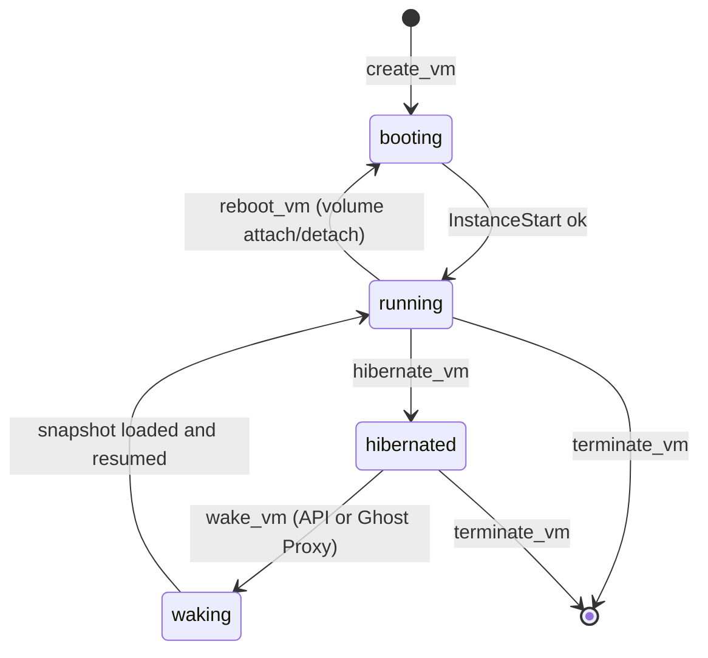
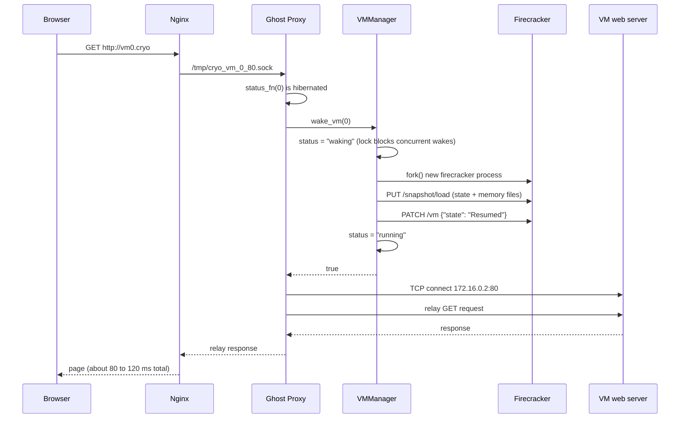

# CryoSpawn: System Architecture & Software Design Document

Welcome to the **CryoSpawn System Architecture and Design Document**! 

Whether you are a seasoned kernel developer, a frontend engineer, or a curious tech enthusiast who has never touched C++ or Linux networking before, this document explains **how every piece of CryoSpawn works under the hood** in simple, plain English (with helpful analogies, diagrams, and exact code breakdowns).

---

## Table of Contents
1. [The Big Picture: What is CryoSpawn?](#1-the-big-picture-what-is-cryospawn)
2. [Component Breakdown (Who Does What?)](#2-component-breakdown-who-does-what)
3. [Database Design (The System's Memory)](#3-database-design-the-systems-memory)
4. [Networking Architecture: How Packets Travel](#4-networking-architecture-how-packets-travel)
   - [The `/30` Subnet Formula](#the-30-subnet-formula)
   - [Outbound Internet (NAT Masquerade)](#outbound-internet-nat-masquerade)
   - [Zero-Trust Subnet Isolation & Inter-VM Linking](#zero-trust-subnet-isolation--inter-vm-linking)
   - [The Ghost Proxy & Unix Domain Sockets (UDS)](#the-ghost-proxy--unix-domain-sockets-uds)
   - [Nginx Ingress (`vmX.cryo`) & Local DNS](#nginx-ingress-vmxcryo--local-dns)
   - [SSH via Unix Socket ProxyCommand](#ssh-via-unix-socket-proxycommand)
5. [End-to-End Data Flows (Step-by-Step)](#5-end-to-end-data-flows-step-by-step)
   - [Flow 1: Creating a MicroVM](#flow-1-creating-a-microvm)
   - [Flow 2: Freezing a VM (Hibernation)](#flow-2-freezing-a-vm-hibernation)
   - [Flow 3: The Magic Auto-Wake (Ghost Proxy in Action)](#flow-3-the-magic-auto-wake-ghost-proxy-in-action)
   - [Flow 4: Destroying a VM & Cleanup](#flow-4-destroying-a-vm--cleanup)
6. [API Reference (HTTP REST Endpoints)](#6-api-reference-http-rest-endpoints)
7. [Core Code Reference: Important Functions](#7-core-code-reference-important-functions)
8. [File System Layout & Artifacts](#8-file-system-layout--artifacts)

---

## 1. The Big Picture: What is CryoSpawn?

Imagine you want to run 20 different Ubuntu Linux servers on your laptop. 
- If you use **VirtualBox** or **VMware**, your laptop will run out of RAM immediately because each virtual machine demands gigabytes of memory and takes 30 to 60 seconds to boot.
- If you use **Docker**, containers share the host Linux kernel, meaning they are not truly isolated virtual hardware machines.

**CryoSpawn** uses **AWS Firecracker** (the same hypervisor engine powering AWS Lambda and Fargate) on top of Linux KVM. 
Instead of booting big, heavy VMs, Firecracker boots **MicroVMs** in **under 150 milliseconds** with minimal overhead.

On top of this engine, CryoSpawn adds our **"Cryo Engine" superpowers**:
1. **Instant Freeze & Thaw (Hibernation):** When a VM is idle, we dump its RAM and CPU registers straight to an SSD snapshot file and kill the process. It consumes **0% CPU and 0 MB RAM**.
2. **Ghost Proxy (Auto-Wake):** When someone sends web traffic to a sleeping VM, CryoSpawn catches the packet in mid-air, restores the VM from SSD in ~80 milliseconds, and delivers the packet seamlessly. To the user browsing the site, it just looks like a fast website!
3. **Zero Host Pollution:** Unlike standard tools that greedily hog TCP ports on your laptop (`8000`, `8080`, `2200`), CryoSpawn uses **Unix Domain Sockets** (`.sock` files) and a single **Nginx Reverse Proxy**. Your laptop stays clean, secure, and unpolluted.

---

## 2. Component Breakdown (Who Does What?)

```
+----------------------------------------------------------------------------+
|                            USER INTERFACE (UI)                             |
|  - Modern Dark-Themed Web Dashboard (HTML5 / Tailwind CSS / Vanilla JS)    |
|  - Real-time polling every 2s for live VM states, IPs, and link buttons    |
+-------------------------------------+--------------------------------------+
                                      | HTTP REST JSON Calls (:8080)
                                      v
+----------------------------------------------------------------------------+
|                       CRYOSPAWN DAEMON (C++17 Engine)                      |
|                                                                            |
|  [main.cpp]                                                                |
|  - Embedded multi-threaded HTTP server (httplib)                           |
|  - Exposes REST API endpoints (/api/vms, /api/links, etc.)                 |
|                                                                            |
|  [orchestrator.hpp]                                                        |
|  - VMManager: Master brain of VM lifecycles                                |
|  - Subprocess forking, state machines ("booting", "running", "hibernated") |
|  - Background Reaper thread (monitors process exits & cleans resources)    |
|                                                                            |
|  [network.hpp]                                                             |
|  - Linux TAP interface creation (ip tuntap, ip addr)                       |
|  - iptables firewall configuration, NAT masquerading, cross-subnet links   |
|                                                                            |
|  [proxy.hpp]                                                               |
|  - Ghost Proxy: Multi-threaded Unix Domain Socket listener                 |
|  - Traffic interceptor & auto-wake caller                                  |
|                                                                            |
|  [database.hpp]                                                            |
|  - SQLite persistence layer (recovers state after daemon reboot)           |
+-------------------+------------------------------------+-------------------+
                    |                                    |
          Fork & Unix Socket API               Unix Domain Sockets (/tmp/*.sock)
                    v                                    v
+--------------------------------------+  +----------------------------------+
|      AWS FIRECRACKER PROCESSES       |  |       HOST NGINX INGRESS         |
|  - KVM virtualization hardware engine|  |  - Wildcard *.cryo routing       |
|  - Loads ubuntu-vmlinux.bin kernel   |  |  - Passes traffic to Ghost Proxy |
|  - Mounts instance Copy-on-Write ext4|  +----------------------------------+
+--------------------------------------+
```

---

## 3. Database Design (The System's Memory)

CryoSpawn uses an embedded **SQLite** database (`cryospawn.db`). If the daemon crashes or your laptop restarts, CryoSpawn looks at this database to immediately re-adopt running VMs, know which IPs belong to whom, and restore all proxy listeners.

### Table: `vms`
Stores every individual MicroVM registered in the platform.

| Column Name | SQL Type | Description / Purpose |
| :--- | :--- | :--- |
| `slot_id` | `INTEGER PRIMARY KEY` | The unique ID (0, 1, 2...) representing this VM's slot. Used for all IP formulas and socket naming. |
| `pid` | `INTEGER` | The Linux Process ID (PID) of the active Firecracker instance. Set to `0` when hibernated. |
| `status` | `TEXT` | Current lifecycle state: `"booting"`, `"running"`, `"hibernated"`, or `"waking"`. |
| `vcpus` | `INTEGER` | Number of virtual CPU cores allocated (e.g., 1 or 2). |
| `mem_mib` | `INTEGER` | Dedicated RAM in Megabytes (e.g., 512, 1024). |
| `guest_ip` | `TEXT` | The internal IP address of the VM inside its virtual network (e.g., `172.16.0.2`). |
| `host_ip` | `TEXT` | The host laptop's gateway IP on the matching TAP interface (e.g., `172.16.0.1`). |
| `tap_name` | `TEXT` | The name of the virtual network card on the host (e.g., `cryo0`). |
| `ssh_exposed`| `INTEGER` | Boolean (`1` or `0`): whether Ghost Proxy should listen for SSH (Port 22). |
| `http_exposed`| `INTEGER` | Boolean (`1` or `0`): whether Ghost Proxy should listen for HTTP (Port 80). |
| `https_exposed`| `INTEGER`| Boolean (`1` or `0`): whether Ghost Proxy should listen for HTTPS (Port 443). |
| `host_port` | `INTEGER` | Legacy port field (kept for schema backward compatibility). |
| `project_name` | `TEXT` | The project namespace (e.g., `"default"`, `"production"`, `"lab1"`). |
| `rootfs_gb` | `INTEGER` | Requested root disk size in GB (default `1` in the schema; the API defaults to `3`). Added by a safe `ALTER TABLE`. |

### Table: `network_links`
Stores custom virtual network bridges established between two isolated VMs.

| Column Name | SQL Type | Description / Purpose |
| :--- | :--- | :--- |
| `id` | `INTEGER PRIMARY KEY AUTOINCREMENT` | Auto-incrementing link ID. |
| `project_name`| `TEXT` | Namespace tag for the connection. |
| `vm1_id` | `INTEGER` | Slot ID of the first VM. |
| `vm2_id` | `INTEGER` | Slot ID of the second VM. |
| *Constraint* | `UNIQUE(vm1_id, vm2_id)` | Prevents duplicate routing rules between the same two VMs. |

### Table: `volumes`
Stores extra ext4 disks (Elastic Storage Volumes) that can be attached to a VM.

| Column Name | SQL Type | Description / Purpose |
| :--- | :--- | :--- |
| `id` | `INTEGER PRIMARY KEY AUTOINCREMENT` | Volume ID. The disk file is `volumes/vol_<id>.ext4`. |
| `name` | `TEXT` | Human-readable name. |
| `size_gb` | `INTEGER` | Size in GB. |
| `attached_vm_id` | `INTEGER DEFAULT -1` | Slot ID of the VM using the volume, or `-1` when detached. |

Volumes are created with `truncate` + `mkfs.ext4`. `configure_and_start()` attaches every volume whose `attached_vm_id` matches the VM as an extra Firecracker drive (`PUT /drives/vol_<id>`). Attaching or detaching reboots a running VM so the drive change takes effect.

---

## 4. Networking Architecture: How Packets Travel

Networking in Firecracker requires careful isolation. Here is how CryoSpawn constructs the entire network fabric without bridges or collisions.

```
       [ Internet (Wi-Fi: wlo1 / Ethernet: eth0) ]
                            ^
                            | (NAT / MASQUERADE)
           [ Host Laptop Linux Kernel (iptables) ]
             |                                 |
       TAP Interface: cryo0              TAP Interface: cryo1
       Host IP: 172.16.0.1/30            Host IP: 172.16.0.5/30
             | (Virtual Wire)                  | (Virtual Wire)
             v                                 v
       Guest Eth0: 172.16.0.2            Guest Eth0: 172.16.0.6
        [ MicroVM 0 ]                     [ MicroVM 1 ]
```

### The `/30` Subnet Formula
To guarantee that no two VMs can ever clash or eavesdrop on each other, every VM gets its own private `/30` point-to-point subnet (which contains exactly **4 IP addresses**: 1 network, 1 host gateway, 1 guest VM, 1 broadcast).

The IP addresses are calculated with pure math based on the VM's `slot_id`:
```cpp
int base = slot * 4;
// Host Laptop TAP Gateway IP:
vm.host_ip = "172.16." + to_string(base / 256) + "." + to_string((base % 256) + 1);

// Guest MicroVM IP:
vm.ip      = "172.16." + to_string(base / 256) + "." + to_string((base % 256) + 2);
```

#### Example IP Mapping Table:
| Slot ID | Subnet CIDR | Host Gateway (`cryoX`) | MicroVM Internal IP |
| :---: | :---: | :---: | :---: |
| **0** | `172.16.0.0/30` | `172.16.0.1` | `172.16.0.2` |
| **1** | `172.16.0.4/30` | `172.16.0.5` | `172.16.0.6` |
| **2** | `172.16.0.8/30` | `172.16.0.9` | `172.16.0.10` |
| **...** | ... | ... | ... |
| **64** | `172.16.1.0/30` | `172.16.1.1` | `172.16.1.2` |

Each VM is given a unique MAC address formatted as:
`06:00:AC:10:XX:YY` (where `AC:10` is hex for `172.16`).

---

### Outbound Internet (NAT Masquerade)
How does a VM ping `google.com`?
1. The VM sends a packet with destination `8.8.8.8` to its default gateway (`172.16.0.1`).
2. The packet hits the virtual `cryo0` TAP device on the host.
3. Linux Kernel IP Forwarding (`net.ipv4.ip_forward = 1`) allows the packet to jump to your physical Wi-Fi interface (`wlo1`).
4. An `iptables` rule applies **NAT Masquerade**:
   ```bash
   sudo iptables -t nat -A POSTROUTING -o wlo1 -j MASQUERADE
   sudo iptables -A FORWARD -i cryo0 -o wlo1 -j ACCEPT
   ```
   The packet's source IP is rewritten to your home router's Wi-Fi IP. When Google responds, Linux rewrites it back and forwards it to `172.16.0.2`.

---

### Zero-Trust Subnet Isolation & Inter-VM Linking
By default, **VMs are completely deaf and blind to each other**.
In `network.hpp`, the baseline firewall drops any packet trying to hop between `cryo` interfaces:
```bash
sudo iptables -A FORWARD -i cryo+ -o cryo+ -d 172.16.0.0/16 -j DROP
```

When you click **"Establish Link"** in the UI to connect VM 0 and VM 1, CryoSpawn inserts high-priority reciprocal forward and masquerade rules:
```bash
sudo iptables -I FORWARD 1 -i cryo0 -o cryo1 -j ACCEPT
sudo iptables -I FORWARD 1 -i cryo1 -o cryo0 -j ACCEPT
sudo iptables -t nat -I POSTROUTING 1 -s 172.16.0.0/16 -o cryo1 -j MASQUERADE
sudo iptables -t nat -I POSTROUTING 1 -s 172.16.0.0/16 -o cryo0 -j MASQUERADE
```
Now—and only now—can VM 0 ping or communicate with VM 1!

---

### The Ghost Proxy & Unix Domain Sockets (UDS)

#### What is a Unix Domain Socket?
Normally, when programs talk to each other over a network, they use TCP ports (`localhost:8080`). But TCP ports:
- Pollute the host's port namespace.
- Can collide with other programs you have running.
- Can be probed by other devices on your Wi-Fi network.

A **Unix Domain Socket** is a file on your disk (like `/tmp/cryo_vm_0_80.sock`) that behaves like a network connection. It has no port number, runs completely inside kernel memory, is faster than TCP, and is 100% isolated to your machine.

#### How Ghost Proxy Works
For every exposed service on a VM, CryoSpawn spins up a lightweight C++ background thread running `run_ghost_proxy()`:
- Port 22 -> `/tmp/cryo_vm_<id>_22.sock`
- Port 80 -> `/tmp/cryo_vm_<id>_80.sock`
- Port 443 -> `/tmp/cryo_vm_<id>_443.sock`

The proxy thread sits on `accept()`. When any byte arrives on that socket:
1. It queries: *"Is VM `<id>` hibernated?"*
2. If **yes**: It triggers `wake_vm(id)`, restoring the Firecracker process in ~80ms.
3. Once running: It establishes a TCP socket to `172.16.0.2:<port>` and pumps the bytes bidirectionally between the Unix socket and the VM!

---

### Nginx Ingress (`vmX.cryo`) & Local DNS

How does typing `http://vm0.cryo` in your browser hit the right Unix Socket?

```
[ Browser: http://vm0.cryo ]
           |
           v (Localhost 127.0.0.1 via /etc/hosts)
[ Host Nginx Port 80 ]
  Rule: server_name ~^vm(?<vmid>\d+)\.cryo$;
           |
           v Extracts $vmid = 0
  proxy_pass http://unix:/tmp/cryo_vm_0_80.sock;
           |
           v
[ Ghost Proxy ] ---> (Wakes VM if needed) ---> [ VM Internal Web Server ]
```

1. **Local DNS:** Your `/etc/hosts` file contains:
   ```
   127.0.0.1 vm0.cryo vm1.cryo
   ```
   When you browse to `vm0.cryo`, your laptop resolves it to `127.0.0.1` (itself).
2. **Nginx Wildcard Regex:** In `/etc/nginx/conf.d/cryospawn.conf`:
   ```nginx
   server {
       listen 80;
       server_name ~^vm(?<vmid>\d+)\.cryo$;

       location / {
           proxy_pass http://unix:/tmp/cryo_vm_${vmid}_80.sock;
           proxy_set_header Host $host;
           proxy_set_header X-Real-IP $remote_addr;
           proxy_http_version 1.1;
       }
   }
   ```
   Nginx captures the number in the domain name (e.g. `vm0` -> `vmid = 0`) and automatically passes the connection directly into `/tmp/cryo_vm_0_80.sock`!

---

### SSH via Unix Socket ProxyCommand
Because SSH does not have HTTP host headers, how do you SSH into a VM without opening a host TCP port?
Using OpenSSH's built-in **`ProxyCommand`** and `netcat` (`nc`):

```bash
ssh -o ProxyCommand="nc -U /tmp/cryo_vm_0_22.sock" root@localhost
```

**What this command does:**
- `ssh` starts up on your laptop.
- Instead of opening a TCP connection to port 22, it executes `nc -U /tmp/cryo_vm_0_22.sock`.
- Netcat connects directly to the Unix Domain Socket.
- Ghost Proxy detects the connection, wakes VM 0 if it was sleeping, and connects to the VM's internal SSH server (`172.16.0.2:22`).
- You are logged into root shell!

---

## 5. End-to-End Data Flows (Step-by-Step)

### VM lifecycle states



### Flow 1: Creating a MicroVM
When you click **"Initialize VM"** in the web dashboard:

```
[UI: Submit Form]
       |
       v (POST /api/vms {"vcpus": 1, "mem_mib": 512, "expose_http": true, ...})
[main.cpp: svr.Post("/api/vms")]
       |
       v
[orchestrator.hpp: create_vm()]
       |-- 1. db.get_next_free_slot() -> Finds slot 0
       |-- 2. Calculates IPs (172.16.0.1 / 172.16.0.2) and MAC address
       |-- 3. setup_cryo_network() -> Creates tap device `cryo0`, assigns IP, sets up NAT
       |-- 4. fork() -> Starts new `firecracker --api-sock /tmp/cryo_0.socket`
       |-- 5. db.insert_vm() -> Records VM in SQLite
       v
[orchestrator.hpp: configure_and_start()] (runs in background thread)
       |-- 1. Waits for /tmp/cryo_0.socket to appear
       |-- 2. PUT /boot-source (passes ubuntu-vmlinux.bin + kernel boot args)
       |-- 3. Copies rootfs/ubuntu-rootfs.ext4 -> instances/vm_0_rootfs.ext4 (Copy-on-Write isolation)
       |      If rootfs_gb >= 3: truncate -s <N>G, e2fsck -fy, resize2fs (grows the disk)
       |-- 4. PUT /drives/rootfs (attaches instances/vm_0_rootfs.ext4)
       |-- 5. PUT /network-interfaces/eth0 (attaches tap device cryo0)
       |-- 6. PUT /machine-config (sets vCPUs and RAM)
       |-- 7. PUT /actions {"action_type": "InstanceStart"} -> KVM executes Linux kernel!
       v
[main.cpp: Spawns Ghost Proxy Threads]
       |-- Spawns thread running run_ghost_proxy("/tmp/cryo_vm_0_80.sock", ...)
       |-- Spawns thread running run_ghost_proxy("/tmp/cryo_vm_0_22.sock", ...)
       v
[MicroVM is Running and Ready!]
```

---

### Flow 2: Freezing a VM (Hibernation)
When you click **"Hibernate"** (or auto-idle triggers):

```
[UI: Hibernate Button]
       |
       v (POST /api/vms/0/hibernate)
[orchestrator.hpp: hibernate_vm(0)]
       |-- 1. Acquires std::lock_guard<std::mutex> lock(mtx)
       |-- 2. PATCH /vm {"state": "Paused"} -> Instantly freezes VM CPU execution
       |-- 3. PUT /snapshot/create {
       |         "snapshot_path": "instances/vm_0_state.snap",
       |         "mem_file_path": "instances/vm_0_mem.ram"
       |      } -> Dumps full RAM and CPU state to disk
       |-- 4. Sets vms[0].status = "hibernated" & updates SQLite
       |-- 5. kill(vms[0].pid, SIGTERM) -> Kills Firecracker process
       v
[Reaper Thread wakes up from waitpid()]
       |-- Sees process exited
       |-- Checks: status == "hibernated"?
       |-- YES: Sets pid = 0, LEAVES DISK AND SNAPSHOT FILES FULLY INTACT!
       v
[VM uses 0 MB RAM and 0% CPU on Host!]
```

---

### Flow 3: The Magic Auto-Wake (Ghost Proxy in Action)
The VM is hibernated. You open your browser and navigate to `http://vm0.cryo`:



---

### Flow 4: Destroying a VM & Cleanup
When you click **"Destroy"** in the UI:

```
[UI: Destroy Button]
       |
       v (DELETE /api/vms/0)
[orchestrator.hpp: terminate_vm(0)]
       |-- 1. Sends SIGTERM / SIGKILL to Firecracker PID (if running)
       |-- 2. cleanup_vm_resources(vm):
       |      - unlinks Firecracker API socket (/tmp/cryo_0.socket)
       |      - unlinks instances/vm_0_rootfs.ext4 (frees SSD disk space)
       |      - unlinks instances/vm_0_state.snap (frees snapshot space)
       |      - unlinks instances/vm_0_mem.ram (frees memory dump)
       |      - unlinks /tmp/cryo_vm_0_22.sock (cleans Ghost Proxy)
       |      - unlinks /tmp/cryo_vm_0_80.sock (cleans Ghost Proxy)
       |      - unlinks /tmp/cryo_vm_0_443.sock (cleans Ghost Proxy)
       |      - teardown_cryo_network("cryo0"): deletes TAP interface & iptables rules
       |      - db.remove_vm(0): Deletes record from SQLite
       v
[System is 100% pristine. Zero leftover files, zero zombie processes.]
```

---

## 6. API Reference (HTTP REST Endpoints)

The CryoSpawn daemon listens on `http://0.0.0.0:8080` and exposes endpoints for VMs (`/api/vms`), network links (`/api/links`) and volumes (`/api/volumes`).

The full endpoint reference, with request and response fields, lives in [docs/API.md](docs/API.md).

---

## 7. Core Code Reference: Important Functions

### In `internal/orchestrator.hpp`:
- `create_vm(vcpus, mem_mib, expose_ssh, expose_http, expose_https, project)`: Calculates network slot IDs, allocates IP/MAC addresses, sets up TAP network interfaces, and forks the Firecracker subprocess.
- `configure_and_start(id, kernel, rootfs)`: Talks to Firecracker's REST socket to configure virtual hardware (kernel, Copy-on-Write rootfs, network interface, vCPUs, RAM) and issues `InstanceStart`.
- `hibernate_vm(id)`: Freezes CPU execution (`PATCH /vm Paused`), dumps memory and snapshot files to disk (`PUT /snapshot/create`), updates database status, and kills the Firecracker process.
- `wake_vm(id)`: Handles thread-safe auto-waking: marks status as `"waking"`, forks a fresh Firecracker process, loads the snapshot files (`PUT /snapshot/load`), and resumes execution (`PATCH /vm Resumed`).
- `start_reaper()`: Background thread running `waitpid()` in an infinite loop. Cleans up crashed or terminated processes while protecting hibernated snapshot files.
- `reconcile_state()`: Runs on daemon startup. Scans the SQLite database, checks if previously registered PIDs are alive, adopts them into memory, and restarts their Ghost Proxies.

### In `internal/proxy.hpp`:
- `run_ghost_proxy(uds_path, vm_ip, vm_port, vm_id, wake_fn, status_fn)`: Creates and binds an `AF_UNIX` stream socket on disk (`chmod 0666` so Nginx can access it). Loops on `accept()` and spawns detached client handler threads.
- `handle_proxy_client(client_sock, vm_ip, vm_port, vm_id, wake_fn, status_fn)`: Checks if the target VM is currently asleep. If so, triggers `wake_vm(vm_id)` and waits for it to become ready. Then connects to the VM's internal IP:Port and launches bidirectional data relays.
- `relay_data(sock1, sock2)`: High-performance bidirectional streaming loop that pipes raw bytes between the Unix socket and the VM TCP socket.

### In `internal/network.hpp`:
- `init_cryo_firewall_baseline(out_iface)`: Configures host-wide IP forwarding, sets up NAT masquerade, and installs the default zero-trust drop rule to isolate all `/30` subnets.
- `setup_cryo_network(tap_name, host_ip, out_iface)`: Uses `ip tuntap add` to create a virtual network card for the VM and assigns the host gateway IP.
- `link_taps(tap1, tap2)` / `unlink_taps(tap1, tap2)`: Injects/removes bidirectional `iptables FORWARD` and `MASQUERADE` rules to dynamically allow two isolated VMs to communicate.

---

## 8. File System Layout & Artifacts

```
CryoSpawn/
├── cryospawn.db                   # SQLite database file storing persistent state
├── README.md                      # Project overview & documentation guide
├── ROADMAP.md                     # Platform vision & phased engineering roadmap
├── DESIGN.md                      # This document (Architecture & Design)
├── docs/                          # SETUP.md (build & run), API.md (HTTP reference)
├── volumes/                       # Attachable disks: vol_<id>.ext4
├── instances/                     # Per-VM dynamic instance files
│   ├── vm_0_rootfs.ext4          # Copy-on-Write disk image for VM 0
│   ├── vm_0_state.snap           # CPU registers & device state snapshot
│   └── vm_0_mem.ram              # RAM memory snapshot file
├── internal/                      # C++ Orchestrator & Backend source code
│   ├── main.cpp                  # Daemon entry point & HTTP REST API server
│   ├── orchestrator.hpp          # MicroVM lifecycle engine & process manager
│   ├── network.hpp               # Network virtualization & iptables rules
│   ├── proxy.hpp                 # Ghost Proxy Unix Domain Socket engine
│   ├── database.hpp              # SQLite persistence layer
│   ├── httplib.h                 # Single-header C++ HTTP server library
│   ├── json.hpp                  # Single-header nlohmann JSON library
│   └── ui/                       # Web Dashboard frontend files
│       ├── index.html            # Main dashboard HTML structure
│       └── app.js                # Frontend state management & API polling
├── rootfs/
│   └── ubuntu-rootfs.ext4        # Golden template rootfs disk image
├── vmlinux/
│   └── ubuntu-vmlinux.bin        # Uncompressed Linux kernel binary
├── utils/
│   └── start_vm_server.sh        # Guest test script for HTTP/HTTPS web servers
└── /tmp/ (System Temporary Directory)
    ├── cryo_0.socket             # Firecracker API control socket for VM 0
    ├── cryo_vm_0_22.sock         # Ghost Proxy Unix Socket for SSH
    ├── cryo_vm_0_80.sock         # Ghost Proxy Unix Socket for HTTP
    └── cryo_vm_0_443.sock        # Ghost Proxy Unix Socket for HTTPS
```
