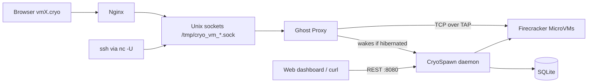

# ❄️ CryoSpawn

CryoSpawn is a MicroVM platform built on AWS Firecracker and Linux KVM. A C++17 daemon creates VMs, gives each one an isolated network, and exposes a REST API and a web dashboard.

## ✨ Features

- **Hibernation:** idle VMs are snapshotted to disk and their Firecracker process is stopped, so they use no CPU or RAM.
- **Ghost Proxy auto-wake:** traffic to a sleeping VM restores it from the snapshot and is then delivered.
- **No host port pollution:** SSH, HTTP and HTTPS are exposed through Unix Domain Sockets and a single Nginx ingress (`vmX.cryo`).
- **Zero-trust networking:** every VM has its own `/30` subnet and cannot reach other VMs unless you link them.
- **Volumes and root disk sizing:** extra ext4 volumes can be attached to VMs, and each VM's root disk size is configurable.
- **Persistence:** state lives in SQLite, so the daemon re-adopts running VMs after a restart.

## 🧭 How it fits together



## 🚀 Quick start

```bash
cd internal
g++ -std=c++17 main.cpp -o cryospawn -pthread -lsqlite3
sudo ./cryospawn
```

Then open `http://localhost:8080`. Prerequisites and the paths you must change first are in the [setup guide](docs/SETUP.md).

Create a VM from the command line:

```bash
curl -X POST http://localhost:8080/api/vms \
  -H 'Content-Type: application/json' \
  -d '{"vcpus":1,"mem_mib":512,"expose_http":true}'
```

## 🗂️ Repository layout

| Path | Contents |
| :--- | :--- |
| `internal/` | Daemon source (`main.cpp`, `orchestrator.hpp`, `network.hpp`, `proxy.hpp`, `database.hpp`) |
| `internal/ui/` | Web dashboard |
| `nginx/` | Script that installs the `vmX.cryo` ingress config |
| `utils/` | Build, cleanup and guest helper scripts |
| `docs/` | Setup and API documentation |

## 📚 Documentation guide

| Doc | Read it for |
| :--- | :--- |
| [docs/SETUP.md](docs/SETUP.md) | Prerequisites, configuring paths, building, running, reaching VMs |
| [docs/API.md](docs/API.md) | Every HTTP endpoint with request and response details |
| [docs/KNOWN-ISSUES.md](docs/KNOWN-ISSUES.md) | Current limitations and workarounds |
| [DESIGN.md](DESIGN.md) | Architecture, database schema, networking and data flows |
| [ROADMAP.md](ROADMAP.md) | Platform vision and engineering milestones |
