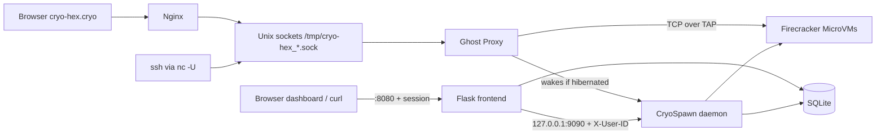

# ❄️ CryoSpawn

CryoSpawn is a MicroVM platform built on AWS Firecracker and Linux KVM. A C++17 daemon creates VMs and gives each one an isolated network. A small Flask frontend adds login and serves the web dashboard.

## ✨ Features

- **Hibernation:** idle VMs are snapshotted to disk and their Firecracker process is stopped, so they use no CPU or RAM.
- **Ghost Proxy auto-wake:** traffic to a sleeping VM restores it from the snapshot and is then delivered.
- **No host port pollution:** SSH, HTTP and HTTPS are exposed through Unix Domain Sockets and a single Nginx ingress (`cryo-<hex>.cryo`).
- **Zero-trust networking:** every VM has its own `/30` subnet and cannot reach other VMs unless you link them.
- **UUIDs and names:** every VM has a name and a public ID like `vm-da05a06c`; the API, TAP devices, sockets and disk files all use it.
- **Login and ownership:** the dashboard sits behind a session login, and the daemon tags VMs with an owner (multi-user support is still partial, see [known issues](docs/KNOWN-ISSUES.md)).
- **Volumes and root disk sizing:** extra ext4 volumes can be attached to VMs, and each VM's root disk size is configurable.
- **Persistence:** state lives in SQLite, so the daemon re-adopts running VMs after a restart.

## 🧭 How it fits together


```mermaid
flowchart LR
    UI[Browser dashboard / curl] -->|":8080 + session"| FL[Flask frontend]
    FL -->|"127.0.0.1:9090 + X-User-ID"| D[CryoSpawn daemon]
    Browser[Browser cryo-hex.cryo] --> N[Nginx]
    SSH[ssh via nc -U] --> S
    N --> S[Unix sockets /tmp/cryo-hex_*.sock]
    S --> G[Ghost Proxy]
    G -->|wakes if hibernated| D
    D --> F[Firecracker MicroVMs]
    D --> DB[(SQLite)]
    FL --> DB
    G -->|TCP over TAP| F
```

## 🚀 Quick start

```bash
cd internal
g++ -std=c++17 main.cpp -o cryospawn -pthread -lsqlite3
cd ..
pip install flask requests
sudo ./internal/cryospawn      # terminal 1: daemon on 127.0.0.1:9090
python frontend/app.py         # terminal 2: dashboard on :8080
```

Then open `http://localhost:8080` and sign in (first-start default: `admin` / `admin123`, change it right away). Prerequisites, the kernel and disk images you must provide, and the details are in the [setup guide](docs/SETUP.md).

Create a VM from the command line:

```bash
curl -c jar -X POST http://localhost:8080/api/auth/login   -H 'Content-Type: application/json' -d '{"username":"admin","password":"admin123"}'
curl -b jar -X POST http://localhost:8080/api/vms   -H 'Content-Type: application/json'   -d '{"name":"web-1","vcpus":1,"mem_mib":512,"expose_http":true}'
```

## 🗂️ Repository layout

| Path | Contents |
| :--- | :--- |
| `internal/` | Daemon source (`main.cpp`, `config.hpp`, `orchestrator.hpp`, `network.hpp`, `proxy.hpp`, `database.hpp`) |
| `internal/ui/` | Dashboard pages (login, MicroVMs, volumes, networks, settings) and `app.js` |
| `frontend/` | Flask app: login, sessions, serves the dashboard, forwards `/api/*` |
| `site/` | Animated flow-map website, deployed to GitHub Pages |
| `nginx/` | Script that installs the `vmX.cryo` ingress config |
| `utils/` | Build, cleanup and guest helper scripts |
| `docs/` | Setup, API, DNS and known-issues documentation |

## 📚 Documentation guide

| Doc | Read it for |
| :--- | :--- |
| [docs/SETUP.md](docs/SETUP.md) | Prerequisites, configuring paths, building, running, reaching VMs |
| [docs/API.md](docs/API.md) | Every HTTP endpoint with request and response details |
| [docs/DNS.md](docs/DNS.md) | Planned Cloudflare and Nginx ingress for a public domain |
| [docs/KNOWN-ISSUES.md](docs/KNOWN-ISSUES.md) | Current limitations and workarounds |
| [DESIGN.md](DESIGN.md) | Architecture, database schema, networking and data flows |
| [ROADMAP.md](ROADMAP.md) | Platform vision and engineering milestones |
